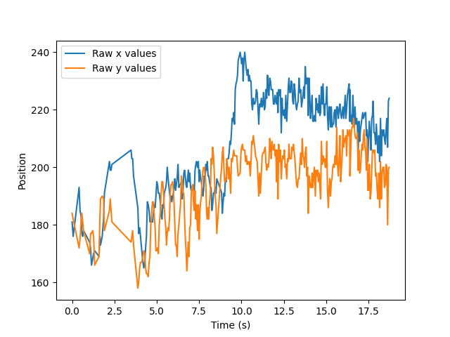
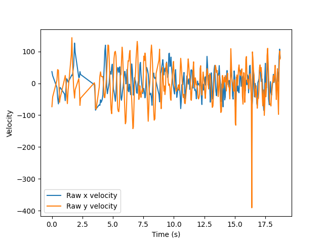

# cv-bpm-calculator

## Setup

Create virtual environment: 
```
python3 -m venv env
```

On Mac or Linux run: 
```
source env/bin/activate
```

On Windows run: 
```
\Scripts\activate.bat
```

Install dependencies:
```
python3 -m pip install -r requirements.txt
```

Run the program:
```
python3 face_detection.py 
```

## Method

We detect faces in `face_detection.py` using OpenCV and LBP cascades.
The face positions, along with their timestamps, are stored for
calculation.

The BPM calculation takes advantage of the periodicity of a head
to calculate a frequency. The data processing can be split into four
parts: (1) sampling, (2) velocity projection, (3) smoothing, and (4)
curve fitting.


### Sampling

Rather than trying to determine the frequency of the data using the
total aggregated data or the most recent data points, we randomly sample
chunks of the data recorded. This is because some areas of the data may
look may be far more periodic than others. In the figure below, the 4-8
second time frame is a much better candidate for fitting a sinusoidal
curve than the most recent time frame is:



After randomly sampling chunks of the raw data, we follow the following
steps for all samples.

### Velocity projection

Head bops can be characterized by the head's position in space, but due
to possible drifts in the actual position (like that shown in the above
figure), the velocity is a more stable metric from which to determine
the song's BPM. For periodic motion, a drift in position translates
simply to a change in amplitude for some periods. The below figure shows
the velocities for the same position data as shown above.



Since the timestamps may be irregular, these are calculated by using an
average of the forward and backward one-sided derivatives, which
converges to the centered-difference formula in the case that both
timesteps are equal.

We calculate the song's BPM using a sinusoidal fit, so we ultimately
would like a one-dimensional time series. Since most head bopping is
(roughly) vertical, we use the y-velocity.

The above data shows excellent periodicity in the 4-8 second time window
for the y-velocity. However, this may not always be the case. Bopping
may look different from person to person and even song to song. So, we
also calculate velocity along some average axis which we'll call the
"bop vector." This is calculated by performing a linear fit on the
sample positions and calculating a vector in the direction of the fit's
slope. We then project the head's velocity at each timestep onto this
bop vector.

There are several possible sources of error when projecting the
velocities along the bop vector, so for some samples the y-data (which
is equivalent to a vertical bop vector projection) may be better for
calculating the BPM. We consider both possibilities by calculating a BPM
for both sets of data and taking the one with less error.

### Smoothing

We have a couple options for smoothing our data, a simple [single moving
average](https://www.itl.nist.gov/div898/handbook/pmc/section4/pmc421.htm)  
and a [double exponentially-weighted moving average](https://www.itl.nist.gov/div898/handbook/pmc/section4/pmc431.htm).
by default the double exponential smoothing is used because it captures
trends well. However, both work well.

### Curve Fitting

We fit the data using a generalized sine function:

,

where 
is the angular frequency of the function. We perform this
fit for both one-dimensional velocities calculated over all samples and
take the one with least squared error in the angular frequency
parameter, which is found by taking the corresponding diagonal element
of the covariance matrix returned by the fit.

To calculate the BPM, we convert the best fit's angular frequency to a
temporal frequency by simply dividing by . Finally, we convert this
per-second frequency to per-minute, giving the BPM.
